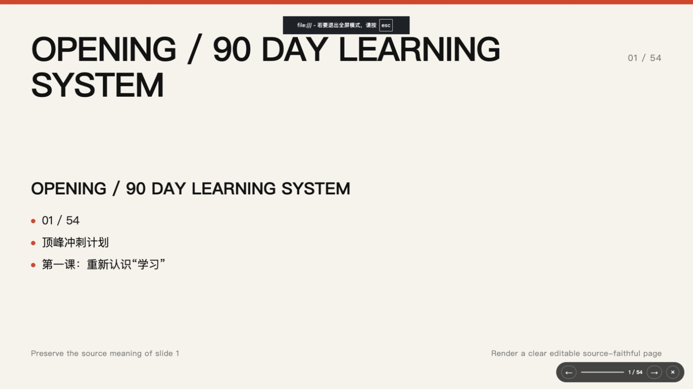
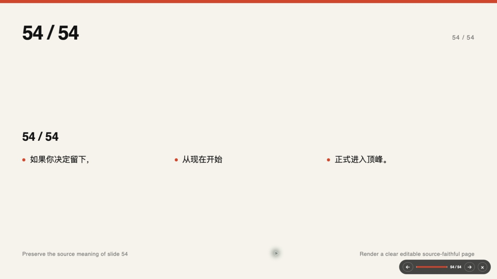

# PPT-Ops

### 从一份资料，到一套可讲、可改、可交付的演示文稿

PPT-Ops 是一套面向真实交付的演示文稿工作流。

它帮助你梳理内容、组织页面、统一视觉，并生成可在浏览器中展示、也可继续编辑的 PowerPoint 文件。

[查看使用方式](#快速开始) · [了解当前进展](#当前进展) · [阅读完整文档](#进一步了解)

> 上图来自一份 54 页真实案例，展示了 PPT-Ops 生成的浏览器演示版本。

## 为什么做 PPT-Ops

做好一份演示文稿，不只是把文字放进页面。

真正影响交付质量的，是内容有没有主线、每一页要让观众记住什么、信息之间是什么关系，以及整套文稿能否稳定地修改、检查和交付。

PPT-Ops 把这些容易遗漏的环节整理成一条清晰流程：

**理解资料 → 梳理大纲 → 设计页面 → 生成初稿 → 检查修改 → 打包交付**

## 它能帮你完成什么

- 把主题、逐字稿或已有资料整理成清晰的大纲
- 为每一页确定重点，减少“内容很多，但观众记不住”的问题
- 根据内容关系选择合适的页面表达方式
- 先制作关键页面，确认方向后再完成整套文稿
- 同时生成浏览器演示稿和可编辑的 PowerPoint 文件
- 保留检查记录和交付文件，方便修改、复盘与再次使用

## 适合这些场景

- 课程与培训课件
- 项目汇报与方案提案
- 发布会与主题演讲
- 企业介绍与产品说明
- 从长文、逐字稿或旧 PPT 重新整理演示内容

## 真实案例

PPT-Ops 已完成一套 54 页案例的生成与浏览器检查，并分别在 Chrome 和 Safari 中完成整套翻页验证。

这套案例验证了从第一页到最后一页的完整展示流程。视觉细节、字体和现场播放效果，仍建议在最终使用的电脑与 PowerPoint 中进行人工确认。

## 快速开始

如果你在 Codex 中使用本仓库，可以直接说：

> 使用 `$ppt-agent`，把这些资料整理成一份可编辑的演示文稿。

然后提供以下任意内容即可开始：

- 一个明确的演讲主题
- 一份逐字稿或文章
- 项目资料与参考图片
- 一份希望重新整理的旧演示文稿

为了获得更合适的结果，建议同时说明听众、使用场景、预计页数和交付时间。

## 最终会得到什么

一次完整交付可以包含：

- 可在浏览器中直接播放的演示版本
- 可继续编辑的 PowerPoint 文件
- 页面与内容检查记录
- 带版本信息的完整交付包

项目源文件与生成结果分开保存，后续修改不会覆盖原始资料。

## 当前进展

PPT-Ops 目前处于 **V1.0 发布候选阶段**。

已经完成：

- 核心制作流程
- 浏览器演示版本
- 可编辑 PowerPoint 文件生成
- 自动检查与交付打包
- 54 页真实案例验证

正式发布前仍计划完成：

- 更多人工视觉检查
- 更多 PowerPoint 实机验证
- 目标用户试用与反馈

因此，当前版本适合体验、研究和参与改进；用于重要现场前，请务必进行人工复核。

## 进一步了解

首页只保留使用者最需要的信息。更完整的设计、开发和验收资料可以从这里继续阅读：

- [产品说明](docs/product-v1.0-blueprint.md)
- [使用与排障指南](docs/operations.md)
- [开发者指南](docs/developer-guide.md)
- [V1 发布候选验收记录](docs/acceptance/v1-release-candidate.md)
- [目标用户试用计划](docs/target-user-trials.md)
- [版本说明](docs/releases/v1.0.0.md)

## 参与项目

欢迎通过 Issue 提交使用反馈、案例问题与改进建议。提交前，请尽量说明使用场景、输入资料类型、期望结果和实际结果，方便更快定位问题。

---

**让每一页都有明确任务，让每一次交付都有据可查。**

