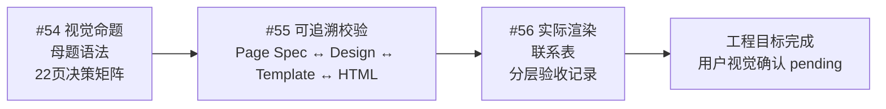

# AI 交付分享｜图形构思系统交付 DAG

> 目标项目：`projects/ai-delivery-first-order`  
> GitHub Epic：[#53](https://github.com/luochen211/ppt-ops/issues/53)  
> 状态：#54、#55、#56 工程交付已完成。自动与渲染证据已通过，用户视觉确认保持独立。

## 1. 目标

把当前“每页各有一个图形”的 HTML 演示稿，升级成一套可解释、可检查、可继续修改的图形构思系统：

- 全篇只有一个视觉命题和不超过四个母题；
- 22 页逐页记录认知任务、信息关系、模板、阅读路径、设计理由和禁用画法；
- 机器可以检查 Page Spec、设计记录、模板目录和 HTML 实现是否漂移；
- 实际渲染代表页，留下可回读的联系表和分层验收记录。

## 2. 边界

- 不改四模块大纲、事实、上屏文案和 22 页顺序；
- 不把单次项目规则扩张成尚未验证的通用产品 Contract；
- 不接管 #50–#52 的 Visual Asset Pipeline、ImageGen 或 PPTX 图片渲染范围；
- 自动检查、浏览器渲染观察、用户视觉确认、PowerPoint 验收和业务验收分别记录。

## 3. DAG

## 4. 节点定义

### #54：视觉母题与逐页决策真源

交付：

- `design-direction.md`：给人阅读的设计方向；
- `design-direction.json`：给校验器读取的逐页决策；
- `templates.json`：当前 HTML 真实使用的语义模板目录；
- 本 DAG 文档。

验收：一个视觉命题、四个母题、22 页无遗漏；不更改事实和现有渲染器。

### #55：跨文件可追溯校验

依赖：#54。

交付：校验模块、命令脚本和回归测试。

验收：页码、Page Spec、关系、图形任务、模板、母题、阅读路径和 HTML `data-layout` 任一漂移都明确失败。

### #56：实际渲染与证据归档

依赖：#55。

交付：机器报告、代表页逐页图和联系表。

验收：浏览器 22 页无控制台错误；路线、层级、因果、流程、对比、证据、阶梯和循环均有代表页；报告不冒充人工验收。

## 5. 执行队列

| 节点 | 依赖 | 初始状态 | 解锁结果 |
|---|---|---|---|
| #54 | 无 | Done | #55 已解锁并完成 |
| #55 | #54 | Done | #56 已解锁 |
| #56 | #55 | Done | 工程目标完成 |

每次 Issue 关闭、CI 状态变化或依赖变化后，重新读取 GitHub 并计算队列；本文只是可读快照，不覆盖实时状态。

## 6. 完成口径

工程目标完成必须同时具备：

1. 设计真源与 22 页实现映射完整；
2. 专项与全量测试通过；
3. 提交已进入 `origin/main`；
4. GitHub Actions 到达成功终态；
5. 渲染证据可回读。

工程目标完成后，以下状态仍可保持待处理：用户视觉确认、Microsoft PowerPoint 实机验收、真实分享现场效果。

## 7. Closeout 证据

- #54：提交 `6255462`；CI `33602673211` 成功；
- #55：提交 `0e94ac7`；本地 98 项测试通过；CI `33602878974` 成功；
- #56：证据提交 `e1adcc0`；22 页浏览器遍历无控制台或页面错误；CI `33603163265` 成功；
- 渲染联系表：`projects/ai-delivery-first-order/review/graphic-conception/contact-sheet.jpg`；
- 机器报告：`projects/ai-delivery-first-order/review/graphic-conception/review-report.json`。

以上证据完成工程目标，不替代用户对视觉母题、记忆点和现场表达效果的确认。
