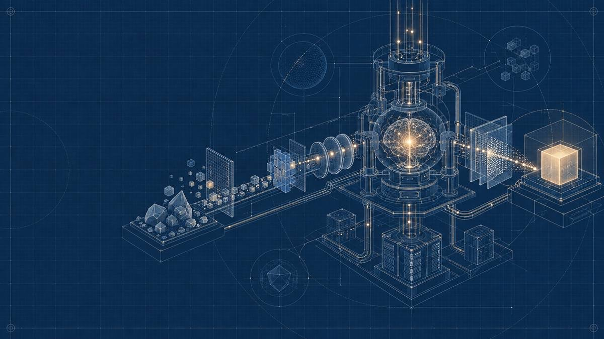

# 线稿蓝图（Technical Blueprint）

工程图纸式的技术视觉模板。核心不是泛化的“科技感”，而是用**精密线稿、清晰路径和可拆解模块**，把抽象流程表现为可以检查、追踪和讨论的系统构造。

## 参考图



本目录保留用户提供的无文字参考图，作为深蓝工程纸、结构线、模块连接与克制重点色的视觉依据。图片只定义视觉语言；页面标题、标签、数字和解释文字应在 PPT 中单独添加并保持可编辑。

## 视觉定义

| 维度 | 模板规则 |
| --- | --- |
| 图纸底色 | 使用午夜蓝或深海军蓝底色，可保留克制的细网格、定位圆和工程辅助线；背景不能抢过主体结构。 |
| 主体造型 | 将系统表现为机械装置、透明剖面、模块、节点、数据块或几何容器；结构需要看起来可以拆解，而不是一团抽象光效。 |
| 线稿 | 以灰白或低饱和浅蓝的精密细线描绘轮廓、内部结构和连接关系；主路径比辅助线更醒目。 |
| 路径关系 | 输入、处理和输出之间应有明确方向；使用管线、连接线、粒子流或节点序列说明关系，但不在图片中生成箭头文字。 |
| 重点色 | 仅用少量琥珀黄或暖白高亮关键节点、能量核心或最终输出；重点色应帮助阅读，不能铺满页面。 |
| 构图 | 主要系统位于页面中部或右侧，左侧通常保留标题与结论空间；也可按页面需要反向，但必须保留清楚的阅读路径。 |
| 文字 | 图片中不生成标题、字母、数字、标签、标志、水印或假文字；所有说明在 PPT 中另行添加，保持可编辑。 |
| 适用场景 | AI 工作流、产品架构、技术方案、数据管线、系统集成、复杂流程与模块关系说明。 |

## 与相近风格的边界

- 不是把任意插画换成深蓝色，也不是用发光线条堆出“未来感”。
- 避免霓虹紫蓝渐变、赛博朋克城市、HUD 假界面、装饰性电路板和无意义粒子雨。
- 不追求照片级机械写实；优先保证模块边界、输入输出与路径关系清楚。
- 不让参考图承担页面文字。图像负责结构隐喻，PPT 元素负责可编辑的信息表达。

## 可复用提示词

将方括号中的内容替换为当前页面的需求：

```text
使用「线稿蓝图（Technical Blueprint）」风格，创作一幅 16:9 横向演示文稿技术插画。

画面要让观众在三秒内理解：[本页要表达的系统、流程或因果关系]。
将 [输入材料或上游模块]、[核心处理系统] 和 [输出结果或下游模块] 表现为可以拆解的工程构造，并用清晰的连接路径说明它们之间的关系。

采用午夜蓝工程图纸背景，以精密灰白结构线描绘轮廓、剖面、节点、管线和模块；主路径清晰，辅助网格与定位线保持克制。
仅用少量琥珀黄或暖白高亮 [最重要的节点、核心或输出]，不要大面积发光。
主体放在 [中部或右侧]，在 [左侧或指定位置] 保留约 [比例] 的干净空间供 PPT 标题和结论使用。

图片中不要生成标题、字母、数字、标签、Logo、水印或假文字。
避免泛化霓虹科技风、赛博朋克、HUD 界面、装饰性电路背景、杂乱粒子和无法解释的连线。
```

## 参考场景示例

> 使用「线稿蓝图」template，表现一个从资料输入到多格式导出的 AI 演示文稿工作流：左下方是可辨认但无文字的资料块，中部偏右是具有透明剖面和内部核心的处理装置，右侧是单一发光输出模块；模块之间通过清晰的白色管线和数据流连接。午夜蓝工程纸背景，精密灰白线稿，仅在处理核心和最终输出使用少量琥珀色高亮。主体集中在右侧约 65%，左侧保留干净空间，图片内无文字、标志或水印。

复用时可以替换为模型训练流程、API 调用链、数据治理管线、产品模块关系或系统迁移方案。持续保留“工程图纸、可拆解结构、清晰路径、克制重点色”四个核心特征。

## 使用检查

- 不看标题也能辨认主要输入、处理核心、输出以及它们的连接方向。
- 主体由可解释的模块、节点和路径构成，不是无意义的科技装饰。
- 主路径与关键节点有清楚的视觉层级，辅助网格不会干扰阅读。
- 琥珀色只用于少量重点；画面没有泛滥霓虹、HUD 假界面或装饰性电路。
- 需要配文时留有足够空间，关键结构未被裁切。
- 图片内没有标题、标签、数字、标志、水印或假文字。

[返回项目 README](../../../README.md)
